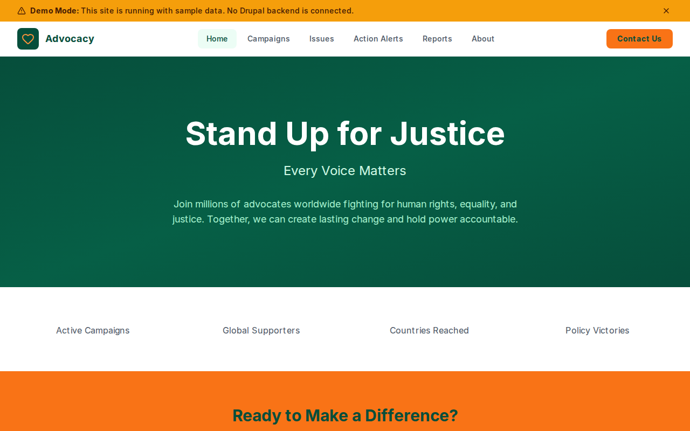

# Decoupled Advocacy

An advocacy organization website starter template for Decoupled Drupal + Next.js. Built for human rights groups, social justice organizations, and nonprofits mobilizing supporters around policy campaigns and direct action.



## Features

- **Campaigns** - Organize advocacy campaigns with goals, issue areas, timelines, and calls to action
- **Issues** - Present key social justice and human rights issues with facts, context, and background
- **Action Alerts** - Publish urgent calls to action with deadlines, urgency levels, and direct action links
- **Reports** - Share research reports, policy briefs, and annual impact documents with downloadable files
- **Modern Design** - Clean, accessible UI optimized for advocacy and mobilization content

## Quick Start

### 1. Clone the template

```bash
npx degit nextagencyio/decoupled-advocacy my-advocacy-org
cd my-advocacy-org
npm install
```

### 2. Run interactive setup

```bash
npm run setup
```

This interactive script will:
- Authenticate with Decoupled.io (opens browser)
- Create a new Drupal space
- Wait for provisioning (~90 seconds)
- Configure your `.env.local` file
- Import sample content

### 3. Start development

```bash
npm run dev
```

Visit [http://localhost:3000](http://localhost:3000)

---

## Manual Setup

If you prefer to run each step manually:

<details>
<summary>Click to expand manual setup steps</summary>

### Authenticate with Decoupled.io

```bash
npx decoupled-cli@latest auth login
```

### Create a Drupal space

```bash
npx decoupled-cli@latest spaces create "My Advocacy Org"
```

Note the space ID returned (e.g., `Space ID: 1234`). Wait ~90 seconds for provisioning.

### Configure environment

```bash
npx decoupled-cli@latest spaces env 1234 --write .env.local
```

### Import content

```bash
npm run setup-content
```

This imports:
- Homepage with hero section, organization statistics, and campaign CTAs
- 3 Campaigns (Protect Voting Rights, Climate Justice Now, Defend Immigrant Rights)
- 4 Issues (Racial Justice, Gender Equality, Economic Justice, Digital Rights & Privacy)
- 3 Action Alerts (Call Senators on Voting Rights, Climate Justice March, Living Wage Petition)
- 3 Reports (2025 Annual Impact Report, State of Voting Access, Climate Equity Scorecard)
- About page and Get Involved page

</details>

## Content Types

### Campaign
- **Issue Area** - Related issue area taxonomy (Civil Rights, Environmental Justice, Immigration, etc.)
- **Campaign Type** - Type of campaign (Legislative, Grassroots, etc.)
- **Goal** - Brief description of the campaign objective
- **Start Date** - When the campaign launched
- **Featured Image** - Campaign hero image

### Issue
- **Issue Area** - Issue area classification taxonomy
- **Key Facts** - Important statistics and facts about this issue
- **Featured Image** - Issue header image

### Action Alert
- **Alert Level** - Urgency level (Urgent, High, Medium)
- **Issue Area** - Related issue area taxonomy
- **Action URL** - Direct link where supporters can take action
- **Deadline** - Time-sensitive deadline for the action
- **Featured Image** - Alert image

### Report
- **Report Type** - Classification (Annual Report, Research Report, Policy Brief)
- **Publication Date** - When the report was published
- **File URL** - Link to the downloadable report document
- **Featured Image** - Report cover image

## Customization

### Colors & Branding
Edit `tailwind.config.js` to customize colors, fonts, and spacing.

### Content Structure
Modify `data/advocacy-content.json` to add or change content types and sample content.

### Components
React components are in `app/components/`. Update them to match your design needs.

## Demo Mode

Demo mode allows you to showcase the application without connecting to a Drupal backend.

### Enable Demo Mode

Set the environment variable:

```bash
NEXT_PUBLIC_DEMO_MODE=true
```

### Removing Demo Mode

To convert to a production app with real data:

1. Delete `lib/demo-mode.ts`
2. Delete `data/mock/` directory
3. Delete `app/components/DemoModeBanner.tsx`
4. Remove `DemoModeBanner` from `app/layout.tsx`
5. Remove demo mode checks from `app/api/graphql/route.ts`

## Deployment

### Vercel (Recommended)
[](https://vercel.com/new/clone?repository-url=https://github.com/nextagencyio/decoupled-advocacy)

Set `NEXT_PUBLIC_DEMO_MODE=true` in Vercel environment variables for a demo deployment.

### Other Platforms
Works with any Node.js hosting platform that supports Next.js.

## Documentation

- [Decoupled.io Docs](https://www.decoupled.io/docs)
- [Next.js Documentation](https://nextjs.org/docs)
- [Drupal GraphQL](https://www.decoupled.io/docs/graphql)

## License

MIT
